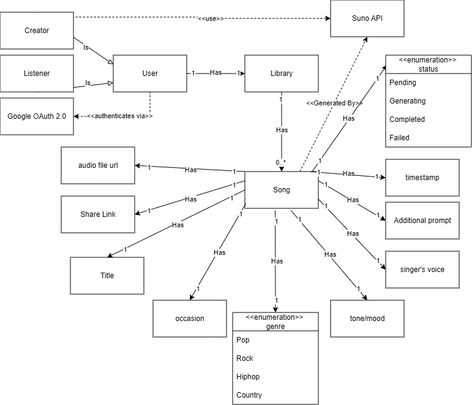

# Cithara

A Django-based web application for generating songs.

## Project Structure

```
Cithara/
├── manage.py              # Django management script
├── db.sqlite3             # SQLite database
├── README.md              # This file
├── mysite/                # Django project configuration
│   ├── settings.py        # Project settings
│   ├── urls.py            # Main URL routing
│   ├── asgi.py            # ASGI config
│   ├── wsgi.py            # WSGI config
│   └── __init__.py
└── songs/                 # Songs Django app
    ├── models.py          # Database models
    ├── views.py           # View logic
    ├── urls.py            # App URL routing
    ├── admin.py           # Django admin configuration
    ├── apps.py            # App configuration
    ├── tests.py           # Tests
    └── migrations/        # Database migrations
```

## Domain Model



The Library entity was merged into the User model to simplify the 1:1 relationship and optimize query performance.

## Setup Instructions

1. **Create a virtual environment:**

   ```bash
   python -m venv venv
   ```

2. **Activate the virtual environment:**
   - On Windows: `venv\Scripts\activate`
   - On macOS/Linux: `source venv/bin/activate`

3. **Install dependencies:**

   ```bash
   pip install -r requirements.txt
   ```

4. **Apply migrations:**

   ```bash
   python manage.py migrate
   ```

5. **Create a superuser**
   ```bash
   python manage.py createsuperuser
   ```

## Running the Application

Start the development server:

```bash
python manage.py runserver
```

The application will be available at `http://127.0.0.1:8000/`

## Admin Panel

Access the Django admin panel at `http://127.0.0.1:8000/admin/` with your superuser credentials.

## Features

- Song management system
- Django admin interface
- URL routing

## API Documentation

For detailed information about the API endpoints, request/response formats, and usage examples, see [API.md](API.md).

The API provides endpoints for:
- Listing all songs
- Creating new songs
- Retrieving song details
- Updating songs
- Deleting songs (soft delete)

## Notes

- Database: SQLite (db.sqlite3)
- Python version: 3.x (as per Django requirements)
