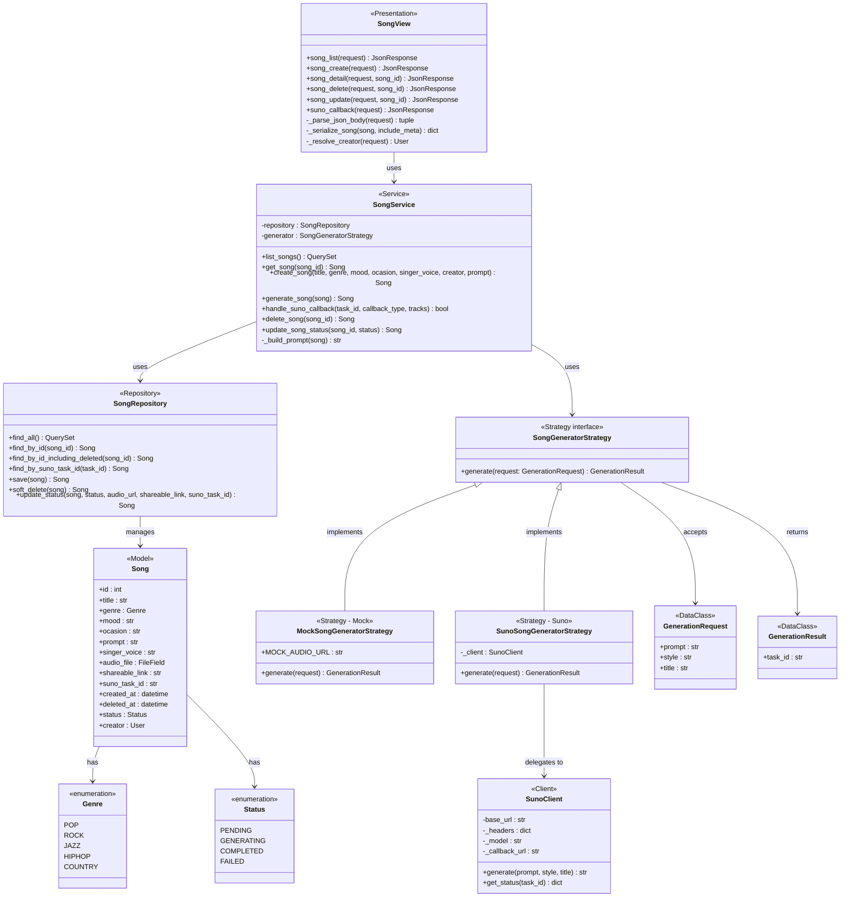

# Design Class Diagram — Layered Architecture

## Layer Responsibilities

| Layer | Module | Responsibility |
|-------|--------|----------------|
| Presentation | `songs/views.py` | HTTP parsing, routing, JSON serialisation |
| Service | `songs/services/song_service.py` | Business logic, orchestration |
| Repository | `songs/repositories/song_repository.py` | Database access (ORM) |
| Client | `songs/clients/suno_client.py` | SUNO external API calls |
| Domain | `songs/models/` | Data model, enumerations |
