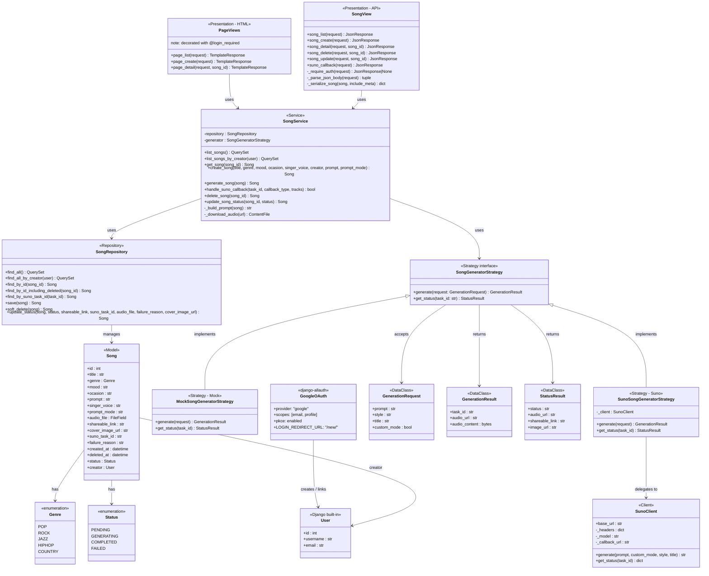

# Design Class Diagram — Layered Architecture

## Layer Responsibilities

| Layer | Module | Responsibility |
|-------|--------|----------------|
| Auth | `django-allauth` + `templates/account/login.html` | Google OAuth2 login, session management |
| Presentation (pages) | `songs/views.py` `page_*` + `songs/templates/` | Server-rendered HTML pages, `@login_required` guard |
| Presentation (API) | `songs/views.py` `song_*` | HTTP parsing, JSON serialisation, 401 auth guard |
| Service | `songs/services/song_service.py` | Business logic, orchestration |
| Repository | `songs/repositories/song_repository.py` | Database access (ORM), per-user filtering |
| Client | `songs/clients/` | Suno external API calls, generation strategies |
| Domain | `songs/models/` | Data model, enumerations |
