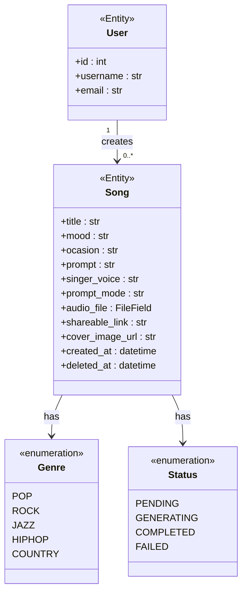

# Domain Model

## Domain Rules

- A **Song** is created by one **User** (the creator).
- A **Song** has exactly one **Genre** and one **Status** at any time.
- Songs are never hard-deleted; `deleted_at` marks soft deletion.
- `prompt_mode` is either `idea` (free-form description) or `lyric` (custom lyrics).
- Status transitions: `PENDING → GENERATING → COMPLETED | FAILED`.
