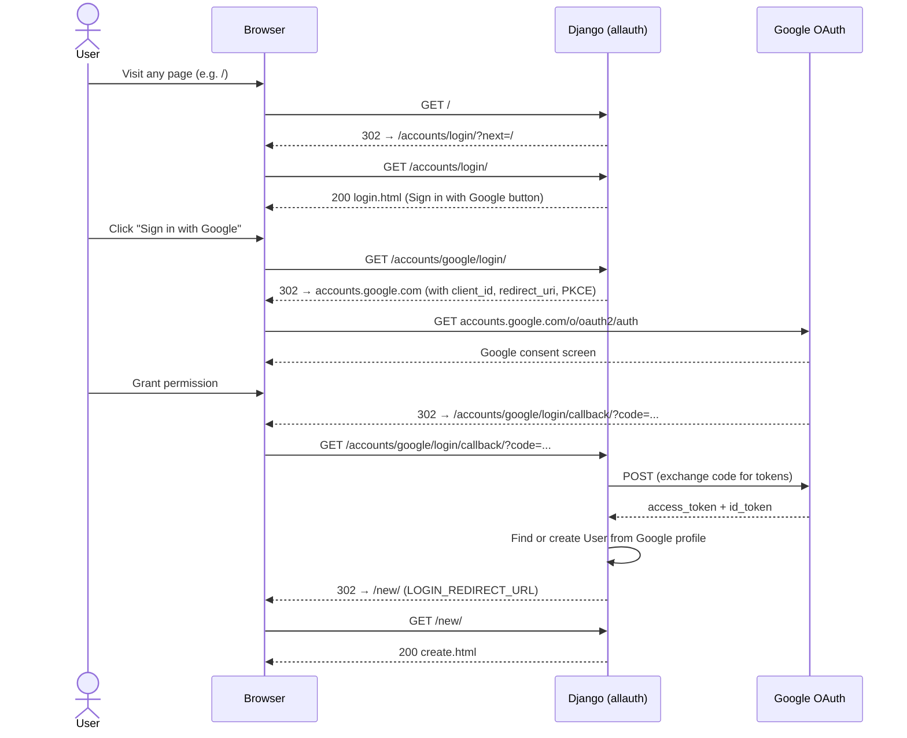
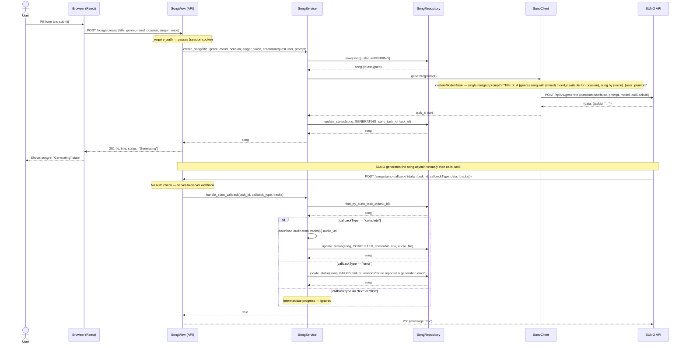

# Sequence Diagrams

## 1. Google OAuth Login Flow

## 2. Song Generation Flow (Suno)

## Notes

- All page views (`/`, `/new/`, `/song/<id>/`) are protected by `@login_required` — unauthenticated requests redirect to `/accounts/login/`.
- All API endpoints (`/songs/*`) return `401` for unauthenticated requests, except `suno-callback` which is intentionally open (server-to-server webhook).
- Each user sees only their own songs — `SongRepository.find_all_by_creator(user)` filters by `creator` and excludes soft-deleted songs.
- Status transitions: `PENDING → GENERATING → COMPLETED | FAILED` (Suno) or `PENDING → COMPLETED | FAILED` (mock, synchronous).
- Suno is called with `customMode=false` — all attributes (title, genre, mood, occasion, voice, user prompt) are merged into a single `prompt` string.
- `failure_reason` is stored on the Song when status transitions to FAILED; surfaced in the detail page UI.
- `shareable_link` is populated with the Suno `audio_url` on success.
- `callBackUrl` must be publicly reachable (use ngrok for local development).
