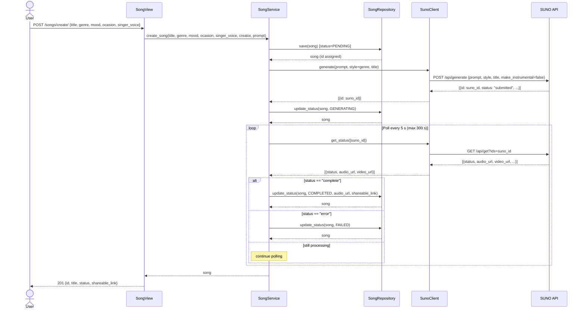

# Sequence Diagram — Song Generation Use Case

## Notes

- Songs are persisted immediately with `PENDING` status so they are visible in `GET /songs/` from the start.
- Status transitions: `PENDING → GENERATING → COMPLETED | FAILED`.
- Polling is synchronous and capped at **300 seconds** (60 × 5 s). If SUNO has not finished by then the song is marked `FAILED`.
- `shareable_link` is populated with the SUNO `audio_url` on success.
