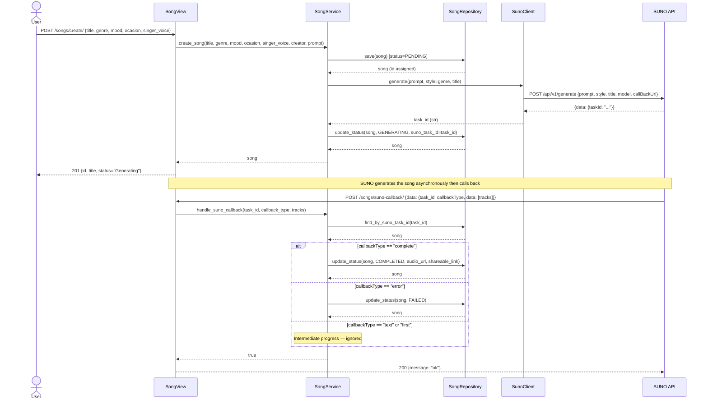

# Sequence Diagram — Song Generation Use Case

## Notes

- Songs are persisted immediately with `PENDING` status so they appear in `GET /songs/` from the start.
- Status transitions: `PENDING → GENERATING → COMPLETED | FAILED`.
- Generation is **non-blocking** — `POST /songs/create/` returns immediately with status `Generating`.
- SUNO calls back our `/songs/suno-callback/` webhook when generation completes or fails.
- `shareable_link` is populated with the SUNO `audio_url` on success.
- The `callBackUrl` must be a publicly reachable URL (e.g. via ngrok during local development).
